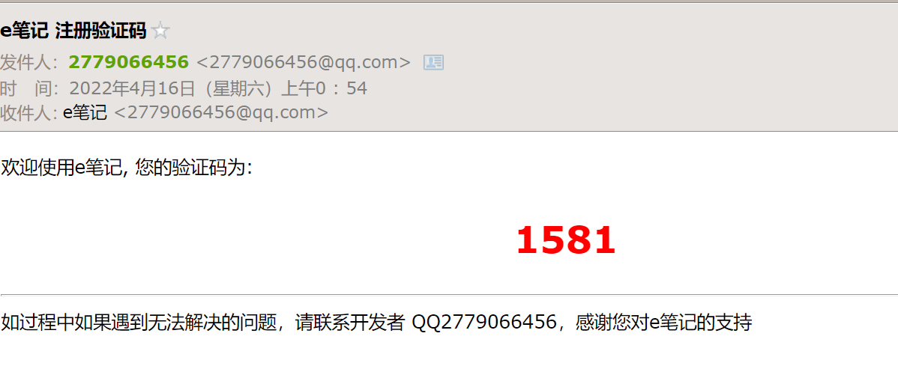
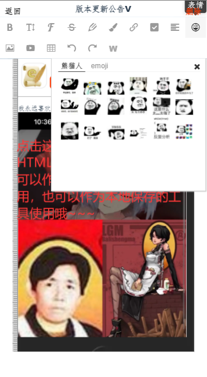
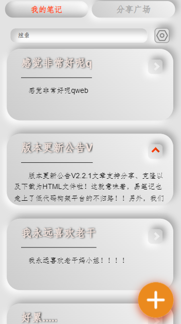
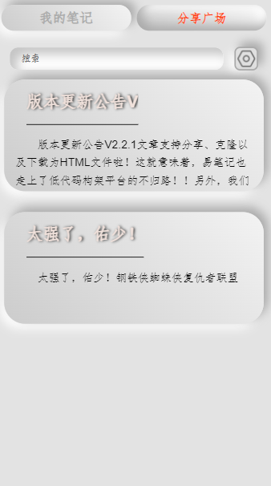

# 易笔记 eNote

## 简介

### 概述

本项目基于Vue2，Node.JS，以及wangeditor V4，

实现了**邮箱认证注册、图片存储、视频存储、内嵌网页、导出为HTML、分享发布**等功能的多媒体笔记应用。


### 关键依赖

>  "axios": "^0.25.0",
>
>   "core-js": "^3.6.5",
>
>   "vue": "^2.6.11",
>
>   "vue-router": "^3.2.0",
>
>   "wangeditor": "^4.7.11"

```shell
npm install
```

## 快速启动

### 运行代码

在终端执行如下命令启动前端

```shell
npm run serve
```


node后端的入口文件位于src/node的main.js文件，默认启动端口为3456

可以到node目录下执行如下命令启动后端

```shell
node main.js
```

### 注册登录


输入邮箱和密码后点击SEND即可发送验证码（前提是要启动后端，并且前后端交互正常）

邮箱认证的相关配置可以在src/node/email.js和src/node/main.js的/sendverification接口代码中进行自定义修改




注册完成后即可登录

### 新建笔记

点击右下角的加号按钮，即可开始新建笔记



点击上方的菜单按钮即可插入表情包、图片、视频、超链接、网页等

出于一些考虑，默认情况下一篇笔记内容中图片、表情包、视频的数量总和不能超过50，且图片大小不超过2M，视频大小不超过200M

编辑完成后，点击返回即可自动保存内容

类似地，之后若要删除，只需要点击右上角的**删除**即可删除笔记

### 内容检索



在输入框中输入的关键字将被用于内容筛选，搜索的方式是检索文章的标题和内容（不包括HTML标签及其属性 和 部分转义字符）是否包含输入的关键字

输入为空则展示所有内容

### 分享笔记



点击每篇笔记右上角的箭头即可进行分享，分享的内容将出现在 **分享广场**，所有用户可见(可读不可编辑)

分享状态下的笔记右上角的图标为橙红色向上的箭头

（**个人笔记**只有当前用户自己可见，可读可编辑，私有状态下的笔记右上角的图标为白色向右的箭头）


>  请注意，一旦进行分享，其他所有用户只可读，但都有对该笔记进行`克隆` `下载为html`等操作的权限
>
> 如果想取消分享，那么再次点击右上角的箭头即可

### 删除、克隆 和 下载为html


这里一共有三个操作:`删除` `克隆` `下载为html`

**删除**

仅有**笔记发布者**和**管理员**有权限删除这篇笔记，删除后将连同**个人笔记**中的对应笔记一并删除

**克隆**

可以将这篇笔记拉取到自己的**个人笔记**中进行二次编辑，但是这类笔记将无法再次分享

**下载为html**

将这篇笔记导出为html文件以供离线本地浏览


## 现有的问题

> 现有的问题，也称`未来开发计划`

问题可以说是非常的多

首先是前后端各种架构上的问题...至少，希望在后来的版本中能够将模块化和工具函数的封装做得更好一点，现在这些代码让我觉得非常羞愧...

其次是安全方面的问题，我也意识到了一些安全方面的问题隐患，但是以我目前的代码逻辑和能力来看，这将是一堆难啃的硬骨头...

最后，就是我个人前端开发被人诟病无数次的UI界面，说实话我认为并不太好看，但是我也尽力去美化了——希望每次被人这么说之后都能做得比以往更好...

还有还有一些多余的话:

> 虽然说这个项目并不怎么样，但是我还是投入了不少精力，在这其中也感受到不少乐趣，所以我希望把这个项目做得越来越好!
>
> 如果有别的疑问，请联系2779066456@qq.com
>
> 我的个人博客: https://serio.gitee.io/

## 开源协议/使用注意事项

具体细则查看：[Configuration Reference](https://cli.vuejs.org/config/).

